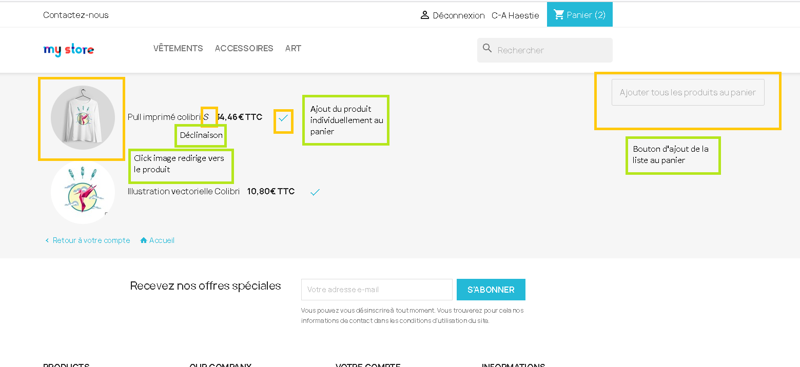
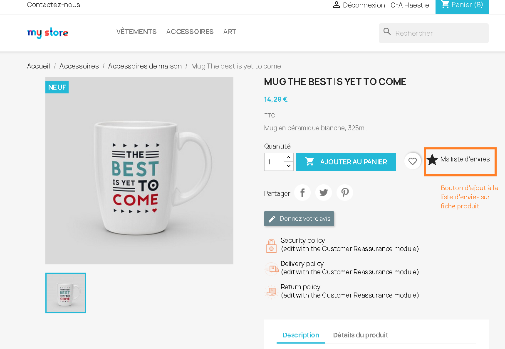
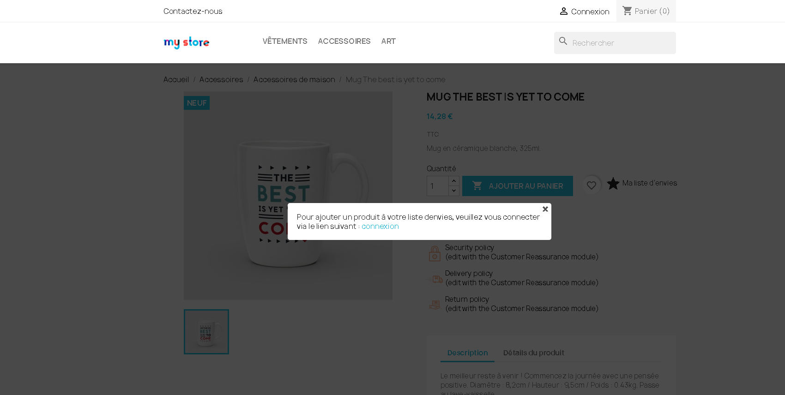

Ajout à la liste d'envies
=====================

Ajoute un bouton sur les fiches produits (récupère la déclinaison sélectionnée) du front office pour permettre aux internautes d’ajouter le produit à leur liste d’envies. 
Via un bouton sur le compte utilisateur, il est possible d'accéder à la liste d'envies et de l'ajouter au panier dans son intégralité ou bien produit par produit en cliquant sur l'icône "Validé". Au clique sur la miniature de l'image, l'utilisateur est redirigé vers la fiche produit en question.

Popup de redirection ver le compte client (garde en mémoire la page consultée pour rediriger vers elle après connexion)

Comment utiliser le module
--------

Il n'y a pa de configuration nécessaire. Il suffit juste de charger le module via l'interface BO de Prestashop. Le bouton apparaît directement sur les fiches produits.
Si l'utilisateur n'est pas connecté, une popup s'affiche avec le lien de redirection vers le compte client du FO.
Si l'utilisateur est connecté, le produit est ajouté à la la liste d'envie et une popup indique que c'est bien le cas.

